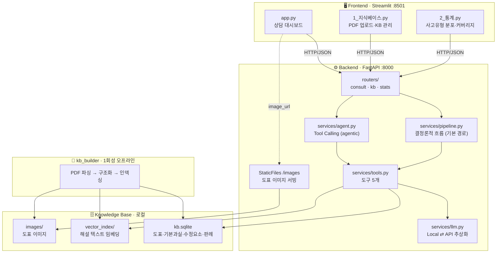
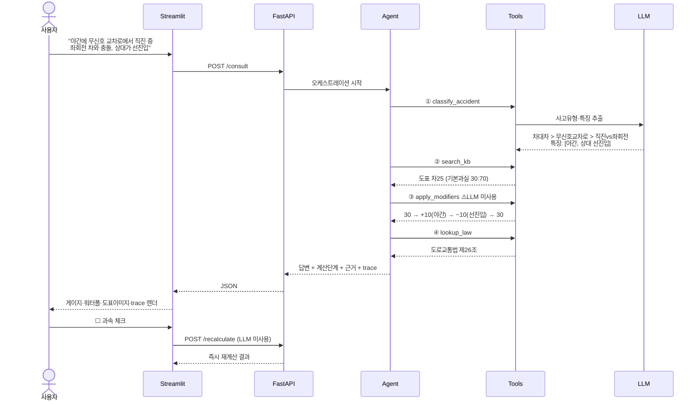

# ⚖️ 자동차 사고 과실비율 상담 에이전트

> **공식 인정기준 기반 · 계산 과정이 보이는 과실비율 대시보드**
> 사고 상황을 자연어로 입력하면, 에이전트가 해당 도표를 찾아 수정요소를 적용한 **계산 과정과 근거 도표를 함께** 제시하는 웹서비스

<p>
  
  
  
  
  
  
</p>

---

## 📌 프로젝트 개요

자동차 사고가 나면 당사자는 보험사가 제시한 과실비율이 **어떤 기준으로 산정됐는지** 알 수 없습니다.
같은 교차로 사고라도 진행 방향·선진입·야간·과속 같은 *수정 요소*에 따라 결과가 달라지는데, 그 **계산 과정이 사용자에게 보이지 않기 때문에** 분쟁으로 이어집니다.

본 프로젝트는 공식 과실비율 인정기준을 구조화된 지식베이스로 재구성하고, **에이전트가 도구를 호출해 단계별로 계산하는 과정을 대시보드로 시각화**합니다.

### 이런 질문에 답합니다
- 💬 "야간에 신호 없는 교차로에서 직진하다 좌회전 차와 부딪혔어요. 과실이 어떻게 되나요?"
- 💬 "상대가 먼저 진입했으면 제 과실이 줄어드나요?"
- 💬 "제가 과속했다면 몇 % 더 붙나요?"
- 💬 "이 사고에 적용되는 도로교통법 조항이 뭐예요?"

> 📢 **핵심 차별점은 "답을 주는 것"이 아니라 "계산 과정을 보여주는 것"입니다.**
> 기본과실 30 → 야간 +10 → 상대 선진입 −10 → **최종 30:70** 을 워터폴 차트로 펼쳐 보여주고,
> 사용자가 수정요소를 직접 켜고 끄면 비율이 즉시 재계산됩니다.

---

## 💡 주제 선정 이유

1. **문제가 실재하고 규모가 크다** — 과실비율 분쟁이 10년간 약 5배 증가

   | 지표 | 값 |
   |---|---:|
   | 과실비율 분쟁 (2014) | 30,260건 |
   | 과실비율 분쟁 (2024) | **156,812건** |
   | 2024년 분쟁 / 대물배상 수리 건수 | 5.4% |

   *출처: 보험연구원 보고서.* 또한 민원의 신속 처리를 위해 금융감독원 민원 일부를 손해보험협회가 처리하도록 제도가 변경(뉴시스 보도)될 정도로 정보 접근성 문제가 계속되고 있습니다.

2. **정답이 명확하고 검증 가능** — 기준 도표에 기본과실·수정요소가 숫자로 확정돼 있어, 답변 정확도를 사람이 바로 확인할 수 있습니다.

3. **계산이 있어서 에이전트가 성립한다** — 단순 검색이 아니라 *분류 → 검색 → 계산 → 법조항 조회*라는 **다단계 도구 호출**이 자연스럽게 도출됩니다. 질의응답형 챗봇과 차별됩니다.

4. **시각화할 게 확실히 있다** — 과실 게이지, 수정요소 워터폴, 근거 도표 이미지, 에이전트 실행 trace. 대시보드로 만들 명분이 있습니다.

5. **도표 이미지가 있어 멀티모달 서빙이 자연스럽다** — 텍스트만 답하는 게 아니라 **근거 도표 원본을 화면에 띄웁니다.**

---

## 📚 대상 문서

| # | 문서 | 용도 | 우선순위 |
|---|---|---|:---:|
| 1 | **자동차사고 과실비율 인정기준** (제10차 개정, 2023.6) | 메인 — 도표·기본과실·수정요소·판례 본체 | **필수** |
| 2 | (2025) 2차로형 회전교차로사고 비정형기준 | 다중 문서 통합 | 2 |
| 3 | (2021) PM(전동킥보드) 대 자동차 비정형기준 | 다중 문서 통합 | 2 |
| 4 | (2020) 신규 비정형사고 기준 | 다중 문서 통합 | 3 |
| 5 | 도로교통법 (law.go.kr) | 법조항 근거 | 2 |
| 6 | 금융감독원 보도자료 | 정책 맥락 (선택) | 4 |

> ⚠️ **메인 PDF는 JS 버튼(`fileDown`)이라 우클릭 저장이 안 됩니다.** 브라우저에서 버튼을 눌러 받아 `data/raw_pdf/`에 넣으세요.
> 🔒 이 PDF는 **"개인 참고용, 배포용 이용 불가"**가 명시돼 있습니다. **저장소에 커밋하지 않습니다** (`.gitignore` 처리 완료).

---

## 🎯 목표

### 최종 목표
공식 과실비율 인정기준을 구조화 지식베이스로 재구성하고, **FastAPI 백엔드 + Streamlit 대시보드로 프론트엔드/백엔드를 분리**하여, 에이전트가 도구를 호출해 과실비율을 산정·설명하는 **완결된 웹서비스**를 구현한다.

### 세부 목표
1. **사용성** — 비전문가가 사고 상황만 적어도 결과와 근거를 이해할 수 있는가
2. **투명성** — 계산 과정과 근거(도표·판례·법조항)를 숨기지 않고 보여주는가
3. **정확성** — 숫자를 LLM이 지어내지 않고, 기준에 없으면 "해당 기준 없음"이라 답하는가
4. **분리** — 무거운 연산이 전부 백엔드에 있고, 프론트는 화면만 담당하는가

> 📢 **이번 모듈의 평가 무게중심은 RAG 깊이가 아니라 웹서비스·사용성입니다.**
> Module 12에서 LLM/RAG는 이미 다뤘으므로, 이 프로젝트는 **에이전트·대시보드·사용성**에 무게를 둡니다.

---

## 🏗️ 시스템 아키텍처



### 설계에서 중요한 결정 3가지

| 결정 | 내용 | 왜 |
|---|---|---|
| **① PDF는 런타임 대상이 아니라 재료** | 매 요청마다 파싱하지 않음. 1회 파싱(+수기 보정) → 구조화 KB → 서비스는 깨끗한 KB에서 동작 | 도표 이미지 파싱 지옥 회피, 응답 안정. 수정요소가 **숫자**라서 에이전트가 실제 계산 가능 |
| **② 고정 파이프라인이 기본, 에이전트는 위에 얹음** | `/consult` = 결정론적(**시연 기본 경로**), `/consult/agent` = LLM 도구 선택 | 폴백을 마감 직전 급조하지 않고, 처음부터 두 경로를 같은 도구 위에 구현 |
| **③ 계산은 순수 함수로 분리** | `apply_modifiers()`는 LLM 무관 | 사용자가 수정요소를 토글하면 **LLM 재호출 없이 즉시 재계산** → 사용성·시연 속도 |

---

## 🔀 에이전트 실행 흐름



> ⚠️ **`apply_modifiers`만 LLM을 타지 않는 게 핵심입니다. 숫자는 절대 LLM이 만들지 않습니다.**
> LLM은 "어떤 요소가 해당되는지 판단"만 하고, 계산은 코드가 합니다. → 환각으로 비율이 틀리는 일이 구조적으로 불가능.

---

## 🧰 에이전트 도구 (5개)

| # | 도구 | 입력 | 출력 | 구현 |
|:---:|---|---|---|---|
| ① | `classify_accident` | 사고 서술(자연어) | 사고유형(대·중·소), 특징 리스트 | LLM 구조화 출력 |
| ② | `search_kb` | 사고유형 + 특징 | 후보 도표 top-k | 메타 필터 + 벡터 검색 |
| ③ | `apply_modifiers` | 도표번호 + 특징 | 기본과실·적용내역·최종비율 | **순수 함수** |
| ④ | `lookup_law` | 키워드 | 도로교통법 관련 조항 | KB 조회 |
| ⑤ | `get_diagram` | 도표번호 | 도표 이미지 URL, PDF 원문 페이지 | 파일 매핑 |

---

## 🖥️ 화면 설계

```
┌ 입력 패널 ─────────────┬ 결과 대시보드 ─────────────────────────┐
│ 사고유형 프리셋 버튼      │ ◉ 과실 게이지        나 30 : 상대 70      │
│ 대 > 중 > 소 선택 트리    │ ◉ 수정요소 워터폴     30 → +10 → −10 → 30 │
│ 상황 서술 입력           │ ◉ 근거 도표 이미지    차25.png + PDF p.148 │
│ 예시 케이스 원클릭 3개     │ ◉ 수정요소 토글       ☑야간 ☑선진입 ☐과속  │
│ [과실비율 확인]          │ ◉ Agent trace        4단계 (펼치기)      │
│                       │ ◉ 판례 · 법조항                          │
│                       │ ◉ [결과 리포트 저장]                      │
└───────────────────────┴──────────────────────────────────────┘
탭: [상담] [지식베이스 관리] [통계 대시보드]
```

**사용성 디테일**: `st.session_state` 대화 이력 / 로딩 스피너·`st.status` / 예시 원클릭 / 에러 핸들링 / 초기화 버튼 / 백엔드 연결 상태 표시

---

## 👥 팀 구성 & 역할 분담 (4인 1팀)

웹서비스 심화가 목표이므로 **프론트·백엔드에 일감을 몰았습니다.**

| 담당 | 역할 | 아키텍처 구간 |
|:---:|---|:---:|
| **오현택** | **Backend / Agent** — FastAPI 설계, 도구 오케스트레이션, 계산 로직 | `routers` `services` |
| **협의 필요** | **팀장** — KB 구축(PDF→구조화), 데이터 파이프라인, 발표 총괄 | `kb_builder` `kb.sqlite` |
| **협의 필요** | **Frontend** — 대시보드·시각화·agent trace UI·사용성 | `frontend` |
| **협의 필요** | **AI / LLM** — 로컬↔API 추상화, 벡터 인덱스, 프롬프트 설계 | `llm.py` `vector_index` |

> 발표는 4명이 각자 자기 파트를 **5분씩(총 20분)** 담당합니다.
> ※ 이름은 킥오프에서 확정합니다. **API 계약(🔌절)만은 첫날 함께 확정**해야 병행 개발이 가능합니다.

---

## 🧪 담당별 심화 항목 (평가표 축 매칭)

평가표에 **"기존 수업에서 다루지 않은 UI 컴포넌트 / API를 추가했는가"**가 명시돼 있습니다.
각 담당은 아래 ⭐ 항목을 자기 승부처로 가져갑니다.

### ① Frontend / Streamlit — 담당 **Frontend**
- **내용**: 3페이지 구조, plotly 게이지·워터폴, 사고유형 선택 트리, 수정요소 토글, 프리셋 원클릭, 결과 리포트 다운로드
- **수업 미출제 컴포넌트**: `plotly` 게이지/워터폴 · `st.status` 실시간 trace · `st.download_button` · multipage
- ⭐ **승부처**: **에이전트 실행 과정을 `st.status`로 실시간 스트리밍**. "① 분류 → ② 검색 → ③ 계산 → ④ 법조항"이 눈앞에서 차례로 채워지는 연출 — 시연 임팩트가 여기서 나옵니다.
- ⭐ **차별화**: 수정요소 토글 → LLM 재호출 없이 즉시 재계산되는 **"AI 추정 + 사람 검증" UX**

### ② Backend / FastAPI + Agent — 담당 **오현택**
- **내용**: 라우터/서비스 분리, 도구 5개 구현, 고정 파이프라인 + 에이전트 이중 경로, `lifespan` 리소스 관리, CORS, Pydantic 스키마 검증
- **수업 미출제 API**: Tool Calling 오케스트레이션 · `StaticFiles` 이미지 서빙 · `/health` 헬스체크 · `/recalculate` 무상태 계산 엔드포인트
- ⭐ **승부처**: **숫자를 LLM에서 분리한 설계.** `apply_modifiers()`를 순수 함수로 두어 환각으로 과실비율이 틀릴 가능성을 구조적으로 제거 — 발표에서 설계 의도로 설명
- ⭐ **차별화**: 같은 도구 위에 **결정론적 경로와 에이전트 경로를 동시에** 구현 → 시연 안정성과 기술 도전을 둘 다 확보

### ③ LLM / RAG — 담당 **AI**
- **내용**: `LLMProvider` 추상화로 로컬(HF Transformers) ⇄ API 한 줄 스위칭, 해설 텍스트 임베딩(BGE-m3), 메타 필터 하이브리드 검색, 환각 차단 프롬프트
- ⭐ **승부처**: **로컬 sLLM vs API 모델 비교.** 특히 tool calling 성공률을 비교해 *"로컬 한계 → API 전환"* 의사결정 과정을 발표에 넣습니다. 마이너스를 플러스로 뒤집는 소재입니다.
- ⭐ **측정 포인트**: 제약형 프롬프트("기준에 없으면 '해당 기준 없음'")의 환각 억제 효과를 **기준에 없는 사고유형 질문**으로 직접 측정

### ④ 지식베이스 구축 — 담당 **팀장**
- **내용**: PyMuPDF로 텍스트·이미지·페이지 렌더 추출, **도표 단위 청킹**, SQLite 구조화, 파싱 실패분 수기 보정
- ⭐ **승부처**: **다중 문서 통합.** 인정기준 + 비정형기준 3종 + 도로교통법을 **하나의 KB 스키마로 정규화** → "다중 PDF 업로드" 요건 충족
- ⭐ **차별화**: "PDF 상세 분석(표·그림) → 구조화 KB 구축" 자체가 PDF 분석 가점. 도표 이미지를 추출·매핑·서빙하는 파이프라인 포함

> ⚠️ **멀티모달 VLM(Qwen2-VL 등)은 손대지 않습니다.** 도표는 이미지로 서빙하고 해설을 검색하는 방식으로 충분하며,
> VLM은 GPU·세팅 비용이 프로젝트를 잡아먹습니다. 발표 "개선 방향"에 한 줄로만 언급합니다.

---

## 🔌 API 계약 (프론트/백 병행 개발의 기준)

**개발 첫날 이 스펙을 확정하고 `backend/schemas.py`에 박습니다.**
그러면 프론트는 목(mock) JSON으로, 백엔드는 실제 로직으로 **동시에** 개발할 수 있습니다.

| Method | Endpoint | 용도 |
|---|---|---|
| `POST` | `/consult` | 상담 (결정론적 파이프라인) — **시연 기본 경로** |
| `POST` | `/consult/agent` | 상담 (에이전트 tool calling) |
| `POST` | `/recalculate` | 수정요소 토글 재계산 (LLM 미사용, 즉시 응답) |
| `POST` | `/kb/ingest` | PDF 업로드 → KB 추가 |
| `GET` | `/kb/items` | KB 항목 목록·검색 |
| `GET` | `/kb/tree` | 사고유형 트리 (프론트 selectbox 채우기) |
| `GET` | `/stats/coverage` | 사고유형별 도표 수 |
| `GET` | `/stats/distribution` | 기본과실 분포 |
| `GET` | `/images/{도표번호}.png` | 도표 이미지 (StaticFiles) |
| `GET` | `/health` | 헬스체크 (프론트 연결 상태 표시) |

<details>
<summary><b>📄 <code>POST /consult</code> 응답 스키마 — 이 구조를 지켜주세요</b></summary>

```json
{
  "사고유형": {"대": "차대차", "중": "무신호교차로", "소": "직진 vs 좌회전"},
  "도표번호": "차25",
  "기본과실": {"A": 30, "B": 70},
  "적용_수정요소": [
    {"조건": "야간", "값": 10, "적용됨": true, "근거": "인정기준 p.148"},
    {"조건": "상대 선진입", "값": -10, "적용됨": true, "근거": "인정기준 p.148"}
  ],
  "미적용_수정요소": [
    {"조건": "과속", "값": 10, "적용됨": false, "근거": "인정기준 p.149"}
  ],
  "최종과실": {"A": 30, "B": 70},
  "계산_단계": [
    {"라벨": "기본과실", "값": 30},
    {"라벨": "야간 +10", "값": 40},
    {"라벨": "상대 선진입 -10", "값": 30}
  ],
  "답변": "신호기가 없는 교차로에서 …",
  "판례": ["대법원 20XX다XXXXX"],
  "법조항": [{"조": "도로교통법 제26조", "내용": "…"}],
  "image_url": "/images/차25.png",
  "pdf_page": 148,
  "trace": [
    {"step": 1, "tool": "classify_accident", "결과": "차대차>무신호교차로>직진vs좌회전"},
    {"step": 2, "tool": "search_kb", "결과": "차25 (유사도 0.87)"},
    {"step": 3, "tool": "apply_modifiers", "결과": "30 → 40 → 30"},
    {"step": 4, "tool": "lookup_law", "결과": "도로교통법 제26조"}
  ],
  "신뢰도": "높음",
  "경고": null
}
```

`계산_단계` → 워터폴 차트 / `trace` → agent trace UI 에 그대로 들어갑니다.
**기준에 없으면** `"경고": "해당 기준을 찾을 수 없습니다"` + `"최종과실": null`. 절대 추측하지 않습니다.

</details>

---

## 🗂️ 폴더 구조

```
fault-ratio-agent/
├── README.md
├── requirements.txt
├── .env.example                  # LLM_PROVIDER, API_KEY (실제 .env는 커밋 금지)
│
├── backend/
│   ├── main.py                   # 라우터 등록, CORS, lifespan KB 로드, /images mount
│   ├── schemas.py                # ★ API 계약의 단일 진실
│   ├── routers/                  # consult.py  kb.py  stats.py
│   └── services/
│       ├── llm.py                # LLMProvider 추상 + Local/API 구현
│       ├── tools.py              # 도구 5개
│       ├── pipeline.py           # 결정론적 흐름
│       ├── agent.py              # tool calling 오케스트레이션
│       └── kb.py                 # SQLite + Chroma 접근
│
├── frontend/
│   ├── app.py                    # 상담 대시보드
│   ├── pages/                    # 1_지식베이스.py  2_통계.py
│   └── components/               # 게이지·워터폴·trace 렌더
│
├── kb_builder/                   # ★ 1회성 오프라인 (서비스가 import 금지)
│   ├── parse_pdf.py  extract_images.py
│   ├── build_sqlite.py  build_vector.py
│   └── manual_patch.csv          # 파싱 실패분 수기 보정
│
└── data/
    ├── raw_pdf/                  # 원본 PDF (.gitignore — 재배포 금지)
    ├── kb.sqlite  vector_index/  images/
```

---

## 🧱 지식베이스 스키마

```python
{
  "도표번호": "차25",
  "사고유형_대": "차대차",
  "사고유형_중": "무신호교차로",
  "사고유형_소": "직진 vs 좌회전",
  "기본과실": {"A": 30, "B": 70},
  "수정요소": [
      {"조건": "야간",       "대상": "A", "값": +10, "근거": "인정기준 p.148"},
      {"조건": "상대 선진입", "대상": "A", "값": -10, "근거": "인정기준 p.148"},
      {"조건": "과속",       "대상": "A", "값": +10, "근거": "인정기준 p.149"}
  ],
  "해설": "신호기가 없는 교차로에서 …",     # ← 이 필드만 벡터 인덱싱
  "판례": ["대법원 20XX다XXXXX"],
  "법조항": ["도로교통법 제26조"],
  "image_path": "images/차25.png",        # ← 임베딩 대상 아님
  "pdf_page": 148
}
```

- ⭐ **청킹은 도표 단위.** 고정 길이(500자) 블라인드 청킹 **금지** — 기본과실과 수정요소가 다른 청크로 찢어지면 답이 무너집니다.
- 도표가 너무 길면 해설/수정요소를 sub-chunk로 나누되 **같은 도표번호로 묶어** 답변 조립 시 합칩니다.
- 사고유형 트리(대>중>소)는 하이브리드 검색의 **메타 필터**로 사용합니다.
- **왜 SQLite도 쓰나**: 벡터DB만으로는 "사고유형별 도표 수", "기본과실 분포" 집계가 불가능합니다. 통계 탭이 SQL 한 줄로 나오고, 발표에서 "구조화 DB + 벡터 인덱스 하이브리드"로 설명이 깔끔해집니다.

---

## 📅 개발 순서

> 📢 **원칙: "완성 못 한 넓은 커버리지"보다 "좁지만 완결된 파이프라인"이 완성도 점수가 높습니다.**
> 사고유형 2~3개(차대차 무신호교차로 등), 도표 20~30개로 MVP를 뚫고 확장합니다.

| 단계 | 목표 | 완료 기준 (DoD) |
|:---:|---|---|
| **0** | 킥오프 | 메인 PDF `get_text()` 찍어 **표가 텍스트인지 이미지인지 확인** / `schemas.py` 커밋 |
| **1** | 세로 관통 | 도표 **1개**로 Streamlit 입력 → FastAPI → 하드코딩 KB → 게이지 표시까지 동작 |
| **2** | KB 확장 | 도표 20~30개 · SQLite · 벡터 인덱스 · 이미지 추출 완료 |
| **3** | 도구 완성 | 도구 5개 · `apply_modifiers` 단위 테스트 통과 · 검색 top-3 육안 확인 |
| **4** | 대시보드 | 게이지·워터폴·토글·근거 도표·trace 전부 표시 |
| **5** | 에이전트 | `/consult/agent` 동작 (**실패 시 `/consult`로 시연 — 포기 가능**) |
| **6** | 마감 | 다중 PDF · 통계 탭 · 리포트 저장 · 프리셋 3개 무결점 |
| **7** | 리허설 | 모델 warm-up · 프리셋 응답 캐시 · **시연 녹화본 백업** |

**게이트 규칙**: 1단계가 안 되면 2단계로 넘어가지 않습니다. 5단계는 언제든 버릴 수 있습니다.

- [ ] **D-day 확정 후 위 단계에 날짜 채우기** ← 킥오프 때 작성

---

## ⚙️ 개발 규칙

**Git**
- `main` 직접 푸시 금지. `feat/frontend-gauge` 형식 브랜치 → PR → 리뷰 1명 → 머지
- 커밋: `feat: 과실 게이지 컴포넌트 추가` / `fix: 수정요소 부호 오류` / `docs: README API 갱신`
- `.gitignore`: `data/raw_pdf/`, `*.pdf`, `.env`, `*.sqlite`, `__pycache__/`

**아키텍처 (배점 직결)**
- RAG·계산 로직을 라우터에 넣지 말고 **반드시 `services/`로 분리** → *모듈 분리* 배점
- Streamlit에 무거운 연산(파싱·임베딩·검색) 넣지 말고 **전부 FastAPI로** → *프론트/백 분리* 배점
- 벡터DB·모델은 `lifespan`에서 **1회만** 로드 (요청마다 로드하면 느려 터짐)
- LLM 호출은 `async` (안 하면 요청 하나가 서버 전체를 막음)
- `CORSMiddleware` 필수 (Streamlit이 다른 포트에서 호출)
- Streamlit은 상호작용마다 전체 재실행 → 이력·업로드 상태는 **`st.session_state`에 저장**

**프롬프트 (가점 항목)**
- 시스템 프롬프트에 *"검색된 도표에 근거해서만 답하고, 없으면 **'해당 기준 없음'**이라 답하라"* 강제
- **숫자는 LLM이 만들지 않습니다.** 과실비율은 `apply_modifiers()` 반환값만 화면에 표시

---

## ⚠️ 리스크 & 폴백

| 리스크 | 폴백 |
|---|---|
| 수정요소 표가 **이미지**라 `get_text()`로 안 잡힘 | 해당 표만 OCR(easyocr) → 안 되면 `manual_patch.csv` 수기 입력. **20~30개면 수기가 더 빠름** |
| 로컬 LLM이 tool calling 실패 | API 폴백. *"로컬 한계 → API 전환"* 비교를 발표에 넣어 플러스로 전환 |
| 에이전트 불안정 | `/consult` 고정 파이프라인으로 시연, 발표에선 "agentic workflow"로 설명 |
| CPU 임베딩이 느림 | Colab GPU로 인덱스 생성 후 `vector_index/` 통째로 공유 |
| 시연 중 지연·네트워크 장애 | 프리셋 3개 응답 캐시 + 시작 시 warm-up + **녹화본 백업** |
| 도표 커버리지 부족 지적 | "MVP 범위를 의도적으로 좁혔고 확장 경로는 KB 추가뿐"이라고 설계 의도로 설명 |

---

## 📄 출처 및 면책

- **자동차사고 과실비율 인정기준** (제10차 개정, 2023.6) — 손해보험협회. **개인 학습용으로만 사용, 재배포하지 않음**
- **도로교통법** — 국가법령정보센터 (law.go.kr)
- **과실비율 분쟁 통계** — 보험연구원 보고서
- **제도 변경 보도** — 뉴시스

> ⚖️ 본 서비스는 공개된 과실비율 인정기준을 **교육 목적으로 재구성한 참고용 도구**입니다.
> 법적 효력이 없으며, 실제 보험사 및 과실비율분쟁심의위원회의 판단과 다를 수 있습니다.
> 기준 개정본 시점의 스냅샷이며, 실제 분쟁 시 전문가와 상담하시기 바랍니다.
> *(앱 화면 하단에 상시 노출합니다)*

---

## ✅ 킥오프 체크리스트

- [ ] 팀원 4명 역할 확정
- [ ] GitHub 저장소 생성 + collaborator 초대 + `.gitignore` 커밋
- [ ] 메인 PDF 다운로드 → `data/raw_pdf/` (**커밋 금지**)
- [ ] **`get_text()` 찍어 수정요소 표가 텍스트인지 이미지인지 확인** ← 여기서 일정이 갈립니다
- [ ] MVP 대상 사고유형 2~3개 합의
- [ ] `schemas.py` API 계약 확정 후 커밋
- [ ] GPU 환경 확인 (로컬 / Colab)
- [ ] D-day 기준으로 개발 순서에 날짜 채우기
