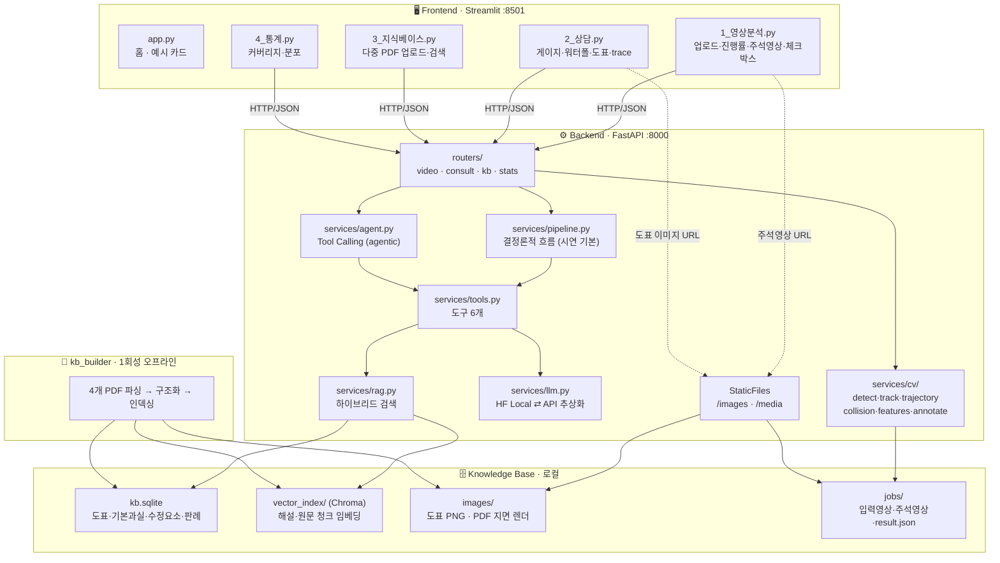

# 🚦 사고 영상으로 보는 과실비율 대시보드

> **경북대 KDT 14기 · Module 13. 웹 기반 AI 서비스 — 미니 프로젝트 (4인 1팀)**
> 교차로 CCTV 사고 영상을 올리면 **차량 검출·추적·궤적·충돌 지점을 화면에 그려서 보여주고**,
> 거기서 뽑은 사고 정보를 **사용자가 확인·수정**한 뒤,
> 공식 과실비율 인정기준(PDF)에서 근거를 검색해 **계산 과정을 눈에 보이게** 제시하는 웹서비스

<p>
  
  
  
  
  
  
  
</p>

---

## 1. 왜 이 주제인가

자동차 사고가 나면 당사자는 보험사가 제시한 과실비율이 **어떤 기준으로 산정됐는지** 알기 어렵습니다.
같은 교차로 사고라도 진행 방향·선진입·야간 같은 *수정 요소*에 따라 결과가 달라지는데,
그 **계산 과정이 보이지 않기 때문에** 분쟁으로 이어집니다.

| 지표 | 값 |
|---|---:|
| 국내 과실비율 분쟁 (2014) | 30,260건 |
| 국내 과실비율 분쟁 (2024) | **156,812건** (약 5배 ↑) |
| 2024년 분쟁 / 대물배상 수리 건수 | 5.4% |

*출처: 보험연구원 보고서. 민원 신속 처리를 위해 금융감독원 민원 일부를 손해보험협회가 처리하도록 제도가 변경(뉴시스)될 정도로 정보 접근성 문제가 지속되고 있습니다.*

### 주제로서 좋은 이유 4가지

1. **정답이 숫자로 확정돼 있다** — 인정기준 도표에 기본과실·수정요소가 숫자로 박혀 있어 **검증 가능**합니다.
2. **계산이 있어서 에이전트가 성립한다** — 단순 Q&A가 아니라 *분류 → 검색 → 계산 → 법조항 조회*의 **다단계 도구 호출**이 자연스럽습니다.
3. **보여줄 그림이 확실히 많다** — 주석 영상, 충돌 순간 프레임, 근거 도표 이미지, 게이지, 워터폴. **"질의응답만 하는 챗봇"과 확실히 구분됩니다.**
4. **문서(PDF) 기반 RAG가 억지가 아니다** — 인정기준 + 비정형기준 3종 = 다중 PDF가 자연스럽게 필요합니다.

---

## 2. 이번 프로젝트가 하는 것 / 하지 않는 것 ★

> **이 절이 이 문서에서 가장 중요합니다.** 범위를 여기서 못 자르면 프로젝트가 끝나지 않습니다.

### ✅ 이번 모듈 기간에 완성하는 것

| # | 항목 |
|:---:|---|
| 1 | **고정형 CCTV 사고영상 2~3개**만 사용 (사전 확보 · 저작권 확인 완료본) |
| 2 | YOLO로 **차량 바운딩박스** 표시 |
| 3 | ByteTrack으로 **차량별 ID 유지** |
| 4 | 차량 **이동 궤적과 진행 방향** 시각화 |
| 5 | **충돌 후보 시점·위치** 표시 |
| 6 | 직진 · 좌회전 · 추돌 같은 **사고유형 후보** 출력 |
| 7 | 사용자가 **분석 결과를 확인·수정** (체크박스 · 되묻기 칩) |
| 8 | **4개 PDF에서 해당 기준과 유사 사례 검색** (RAG) |
| 9 | **기본과실 · 수정요소 · 최종 비율을 대시보드로 표시** |

```
영상 업로드 → 차량 검출·추적 시각화 → 사고정보 후보 추출
          → 사용자 확인 → PDF 기준 검색 → 과실비율 계산
```

### ❌ 하지 않는 것 (시도하면 프로젝트가 무너집니다)

| 하지 않음 | 이유 | 대신 |
|---|---|---|
| 아무 블랙박스 영상이나 분석 | 자차가 화면에 없어 "나(A)의 궤적"을 **관측 자체가 불가** | 고정 CCTV만 지원. 블랙박스 업로드 시 안내 후 텍스트 입력 유도 |
| 영상만 보고 신호 위반 자동 판단 | 신호등 색 판정 신뢰도가 너무 낮음 | **되묻기 칩** — "신호등이 있는 교차로였나요?" |
| 실제 속도·과속 여부 계산 | 픽셀→실제 속도 변환은 원근 때문에 오차 큼 | 두 차의 **상대 비율**만 참고값으로 표시, 과속은 되묻기 |
| 선진입을 항상 정확히 판정 | 교차 영역 정의·가림에 취약 | 0.3초 이상 차이날 때만 **후보**로 제시(신뢰도 표시), 아니면 보류 |
| 영상만으로 최종 과실비율 확정 | 애초에 이 프로젝트의 목표가 아님 | **사용자 확인 후** 기존 파이프라인이 계산 |
| 멀티모달 VLM(Qwen2-VL 등) | GPU·세팅 비용이 프로젝트를 잡아먹음 | 발표 "개선 방향"에 한 줄만 |
| 실시간 스트리밍 분석 | 불필요 | 업로드 → 비동기 잡 → 폴링 |

---

## 3. 핵심 원칙 — CV는 판정기가 아니라 입력 어댑터 ★

```
영상 → YOLO + ByteTrack → [ 자동 추출 가능한 것만 ]
                            ├─ 충돌 시점                          ✅
                            ├─ 관여 객체(차/이륜/보행자/PM) → 사고유형 '대'  ✅
                            ├─ 주야 판정 → 수정요소 '야간'          ✅
                            ├─ 상대 속도·충돌 각도 → 과속/추돌 후보   ✅
                            └─ 접근 순서 → '선진입' 후보            ✅
                                        ↓
                    화면에 자동 채워진 체크박스로 제시
                                        ↓
                    사용자가 확인 · 수정 → 기존 파이프라인 → 과실비율
```

### 이 원칙에서 파생되는 4가지 규칙

**① CV가 틀려도 서비스가 무너지지 않는다**
CV는 **후보**만 제안합니다. 정확도에 시스템 전체가 인질로 잡히지 않습니다.

**② 숫자는 오직 `apply_modifiers()` 순수 함수만 만든다**
LLM도, CV도 과실비율 숫자를 만들지 않습니다. → 환각으로 비율이 틀리는 일이 **구조적으로 불가능**하고,
사용자가 체크박스를 토글하면 **LLM 재호출 없이 즉시 재계산**됩니다.

**③ 모든 추출 특징은 신뢰도를 함께 낸다**
```
신뢰도 ≥ 0.7    자동 적용 (체크박스 켜진 상태로 제시)
0.4 ~ 0.7      제시하되 꺼진 상태 (사용자가 켜야 반영)
< 0.4          적용 안 함 → 되묻기 질문으로 승격
```
"신호등이 있는 교차로였나요?" ← CV가 확신 못 한 것이 **그대로 질문**이 됩니다.

**④ 텍스트 경로가 항상 기본, 영상은 선택 경로**
시연은 텍스트 입력만으로도 완주 가능해야 합니다. 영상 분석 실패 시 텍스트 입력으로 안내합니다.

---

## 4. 화면에 반드시 보여야 하는 것 ★

> **YOLO 결과가 내부 데이터로만 쓰이면 안 됩니다. 사용자가 화면에서 바로 확인할 수 있어야 합니다.**
> 이게 "AI를 붙였다"와 "AI 웹서비스를 만들었다"의 차이입니다.

### 4-1. 주석 영상 오버레이 체크리스트

| # | 표시 항목 | 렌더 |
|:---:|---|---|
| 1 | 차량 **바운딩박스** | track_id별 고정 색상 |
| 2 | **객체 종류와 신뢰도** | `car 0.88` |
| 3 | 차량별 고유 **`track_id`** | 박스 좌상단 배지 |
| 4 | 차량 **이동 궤적** | 접지점 폴리라인 (최근 N프레임 페이드) |
| 5 | **충돌 후보 차량 강조** | 해당 두 트랙만 굵은 빨간 테두리 |
| 6 | **충돌 후보 시점·위치** | 충돌 지점 ✕ 마커 + `t = 4.2s` 오버레이 |
| 7 | **분석된 특징 표시** | 진행 방향 화살표 · 교차각 `87°` · `야간` 배지 · `선진입 후보: 상대` |

### 4-2. 영상 외에 화면에 띄우는 "그림"

단순 질의응답이 아니라는 걸 보여주는 시각 자산입니다.

- 🎞️ **주석 영상 재생** (`st.video`)
- 📸 **충돌 순간 프레임 3컷** — `t_c − 1.0s` / `t_c` / `t_c + 1.0s` 를 나란히 (`st.columns`)
- 🗺️ **궤적 요약 이미지** — 첫 프레임 위에 두 차량 전체 궤적을 겹쳐 그린 1장
- 📊 **근거 도표 이미지** — 인정기준 원본 도표 PNG (`/images/차25.png`)
- 📄 **PDF 원문 페이지 렌더** — 검색된 근거의 실제 지면 이미지 + 페이지 번호
- 🎯 **과실 게이지** / 🪜 **수정요소 워터폴** (plotly)

---

## 5. 아키텍처



### 데이터 흐름 한 줄 요약

```
영상 ─(비동기 잡)→ CV 후보 ─(사용자 확인)→ 사고유형+특징 ─(RAG)→ 근거 도표 ─(순수함수)→ 과실비율 ─(LLM)→ 설명문
```

---

## 6. 기술별 역할 분담

> **YOLO만으로 전부 하는 게 아닙니다.** 각 기술이 맡는 구간이 명확히 나뉩니다 — 발표에서 이대로 설명하세요.

| 기술 | 담당 구간 |
|---|---|
| **YOLO (v8n, COCO)** | 차량·이륜차·보행자 **검출** |
| **ByteTrack** | 같은 차량을 프레임마다 **추적** (`track_id` 유지) |
| **OpenCV** | 궤적 · 충돌지점 · 방향 **계산 및 영상 위에 그림** |
| **규칙 기반 분석** | 직진 · 회전 · 선진입 **후보 판단** (학습 데이터가 없으므로 규칙이 정답) |
| **RAG (Chroma + SQLite)** | 해당 사고유형의 **기준 검색** · 유사 사례 검색 |
| **순수 함수 `apply_modifiers`** | 기본과실 + 수정요소 → **최종 비율 계산** |
| **LLM (HF Transformers / API)** | 사고 서술 분류 · 도구 선택(agent) · **근거 기반 설명문 생성** |

> 💡 **왜 S6(사고유형 매핑)이 규칙 기반인가**: 공개 사고 데이터셋(CCD·DoTA·A3D)은
> "사고 여부·시점·관여 객체"까지만 라벨링합니다. **직진/좌회전·신호 유무 라벨은 어떤 공개 데이터셋에도 없습니다.**
> 학습이 불가능하므로 규칙 결정트리가 이 조건에서의 정답이며, **설명 가능하고 틀렸을 때 어디가 틀렸는지 보인다**는 장점도 있습니다.

### CV 파이프라인 (요약 — 상세는 [PIPELINE.md](PIPELINE.md))

```
S0 영상 정규화     10fps 리샘플 · 720p 이하 · 최대 15초
S1 카메라 유형 판별  광류 크기로 fixed(CCTV) / dashcam 분기 → dashcam이면 안내 후 축소 모드
S2 검출 + 추적     YOLO(COCO) + ByteTrack → track_id별 궤적
S3 궤적 정제       접지점(bottom-center) · Savitzky-Golay 평활
S4 충돌 감지       0.4·IoU + 0.2·근접 + 0.25·급감속 + 0.15·방향급변 → argmax = t_c
S5 특징 추출       진행방향 θ · 진입각 Δθ · 곡률 κ · 선진입 · 충돌부위 · 야간
S6 사고유형 매핑    규칙 결정트리 → (대,중,소) + 특징후보[] + 신뢰도 + 되묻기[]
S7 주석 렌더       바운딩박스·ID·궤적·충돌마커·특징배지 → annotated.mp4 + 프레임 3컷
```

**⚠️ 구현 시 반드시 지킬 것**

1. **고정 카메라 영상만 지원.** 블랙박스는 자차 궤적을 관측할 수 없습니다.
2. **좌/우회전 부호를 합성 궤적 테스트로 먼저 검증하세요.** 이미지 좌표는 y축이 아래를 향합니다.
   여기서 부호가 뒤집히면 **과실비율이 정반대로 나옵니다.** 가장 치명적인 버그입니다.
3. **특징은 충돌 직전 구간(`t_c−2.0s ~ t_c−0.3s`)에서만 추출.** 충돌 순간 박스가 겹치면 ID 스위칭이 잦습니다.
4. **속도로 과속을 판정하지 마세요.** 상대 비율로만 쓰고 과속 여부는 되묻기로.
5. **최대 점수 < 0.45면 "충돌을 감지하지 못했습니다" 반환.** 절대 추측하지 않습니다.

---

### 9-1. 수업에서 다루지 않은 Streamlit 컴포넌트

| 컴포넌트 | 어디에 쓰나 |
|---|---|
| `st.video` | 주석 영상 재생 |
| `st.status` + `st.progress` | CV 잡 진행률 **실시간 스트리밍** ★ 시연 임팩트 |
| `st.file_uploader(type=["mp4"])` | 영상 업로드 (수업은 PDF만) |
| `plotly` 게이지 · 워터폴 | 과실비율 · 계산 단계 시각화 |
| `st.columns` + `st.image` | 충돌 순간 프레임 3컷 |
| `st.toggle` / `st.checkbox` 즉시 재계산 | **AI 추정 + 사람 검증** UX |
| `st.download_button` | 결과 리포트 저장 |
| `st.tabs` / multipage | 5개 페이지 구조 |
| `st.session_state` | 잡 ID · 체크박스 상태 · 대화 이력 |
| `st.chat_message` / `st.chat_input` | 후속 질의응답 |
| 커스텀 CSS (`st.markdown(unsafe_allow_html=True)`) | 신뢰도 배지 · 되묻기 칩 |

### 9-2. 수업에서 다루지 않은 FastAPI 기능

| 기능 | 어디에 쓰나 |
|---|---|
| `BackgroundTasks` + 잡 폴링 | 영상 분석 (요청-응답으로 묶으면 타임아웃) ★ |
| `StaticFiles` 마운트 2개 | `/images` 도표 · `/media` 주석 영상 |
| `lifespan` | YOLO·임베딩 모델 **1회만** 로드 |
| `CORSMiddleware` | Streamlit(다른 포트) 호출 허용 |
| Pydantic `schemas.py` | **API 계약의 단일 진실** — 프론트가 mock으로 병행 개발 |
| `/health` | 프론트 연결 상태 배지 |
| `/recalculate` | **LLM 미사용 무상태 계산 엔드포인트** |
| Tool Calling 오케스트레이션 | 에이전트 경로 |
| `StreamingResponse` (선택) | 답변 토큰 스트리밍 |

### 9-3. 사용성 디테일 (여기서 점수가 갈립니다)

- 예시 영상 **원클릭 카드 3개** — 시연에서 업로드 기다릴 일이 없음
- 잡 진행률 + 단계별 로그가 **실시간으로 채워짐**
- CV 결과에 **신뢰도 배지**(높음/보통/낮음)를 색으로 구분
- 확신 못 한 항목은 **되묻기 칩** — 클릭하면 바로 답변 UI
- 체크박스 토글 시 **즉시 재계산** (LLM 재호출 없음)
- 근거를 숨기지 않음 — 도표 원본 + PDF 지면 + 페이지 번호
- 백엔드 연결 끊김 / 영상 분석 실패 / 기준 없음 → **각각 다른 안내 메시지**
- 초기화 버튼 · 결과 리포트 다운로드
- 면책 문구 **상시 노출**

---

## 10. RAG / 지식베이스 설계

> 평가표 **LLM/RAG 20점**: *"벡터DB를 이용해 문맥을 저장·검색하는가 / PDF 저장·검색 방식·프롬프트로 RAG 성능을 향상했는가"*
> → 문서 기반 RAG는 **그대로 유지**합니다. 영상은 RAG를 대체하는 게 아니라 **RAG의 입력을 만들어 주는 것**입니다.

### 10-1. 왜 SQLite + Chroma 하이브리드인가

| | 담당 |
|---|---|
| **SQLite** | 도표번호 · 사고유형(대/중/소) · 기본과실 · 수정요소 **숫자** · 판례 · 법조항 |
| **Chroma** | 해설 텍스트 · PDF 원문 청크 임베딩 (의미 검색 · 유사 사례) |

- **수정요소가 구조화된 숫자여야 에이전트가 실제 계산을 할 수 있습니다.** (기본 30 + 야간 10 = 40)
  벡터DB만 쓰면 "30이라는 텍스트를 검색"까지만 되고 계산은 LLM 환각에 맡겨집니다.
- 벡터DB만으로는 "사고유형별 도표 수", "기본과실 분포" 같은 **집계가 불가능**합니다 → 통계 페이지가 SQL 한 줄로 나옵니다.
- 발표에서 **"구조화 DB + 벡터 인덱스 하이브리드"**로 설명이 깔끔합니다.

### 10-2. PDF는 "런타임 대상"이 아니라 "재료"

매 요청마다 PDF를 파싱하지 않습니다. **최초 1회 파싱(+수기 보정)** 으로 구조화 KB를 만들고,
서비스는 깨끗한 KB에서 동작합니다. → 도표 이미지 파싱 지옥을 피하고 응답이 안정됩니다.
동시에 `/kb/ingest`로 **런타임 PDF 추가 업로드**도 지원합니다(수업 Step 5 요건 + 다중 PDF 가점).

### 10-3. 청킹 규칙

- ⭐ **청킹은 도표 단위.** 고정 길이(500자) 블라인드 청킹 **금지** —
  기본과실과 수정요소가 다른 청크로 찢어지면 답이 무너집니다.
- 도표가 길면 해설/수정요소를 sub-chunk로 나누되 **같은 도표번호로 묶어** 답변 조립 시 합칩니다.
- 사고유형 트리(대>중>소)는 하이브리드 검색의 **메타 필터**로 사용합니다.

### 10-4. KB 스키마

```python
{
  "도표번호": "차25",
  "사고유형_대": "차대차",
  "사고유형_중": "무신호교차로",
  "사고유형_소": "직진 vs 좌회전",
  "기본과실": {"A": 30, "B": 70},          # A = 상담자(나), B = 상대
  "수정요소": [
      {"조건": "야간",       "대상": "A", "값": +10, "근거": "인정기준 p.148"},
      {"조건": "상대 선진입", "대상": "A", "값": -10, "근거": "인정기준 p.148"},
      {"조건": "과속",       "대상": "A", "값": +10, "근거": "인정기준 p.149"}
  ],
  "해설": "신호기가 없는 교차로에서 …",        # ← 이 필드만 벡터 인덱싱
  "판례": ["대법원 20XX다XXXXX"],
  "법조항": ["도로교통법 제26조"],
  "image_path": "images/차25.png",           # ← 임베딩 대상 아님
  "pdf_page": 148,
  "키워드": ["무신호", "교차로", "직진", "좌회전"],
  "출처": "인정기준 제10차 개정"
}
```

### 10-5. 대상 문서 4종 + 법령

| # | 문서 | 용도 | 우선순위 |
|:---:|---|---|:---:|
| 1 | **자동차사고 과실비율 인정기준** (제10차 개정, 2023.6) | 메인 — 도표·기본과실·수정요소·판례 | **필수** |
| 2 | (2025) 2차로형 회전교차로사고 비정형기준 | 다중 문서 통합 | 2 |
| 3 | (2021) PM(전동킥보드) 대 자동차 비정형기준 | 다중 문서 통합 | 2 |
| 4 | (2020) 신규 비정형사고 기준 | 다중 문서 통합 | 3 |
| 5 | 도로교통법 (law.go.kr) | 법조항 근거 | 2 |

> ⚠️ 메인 PDF는 JS 버튼(`fileDown`)이라 우클릭 저장이 안 됩니다. 브라우저에서 버튼을 눌러 받아
> `data/raw_pdf/`에 넣으세요. 이 폴더는 `.gitignore`이며 **저장소에 올리지 않습니다.**

### 10-6. RAG 성능 향상 항목 (발표 가점)

- 도표 단위 청킹 vs 고정 길이 청킹 **검색 정확도 비교**
- 메타 필터(사고유형 트리) 적용 전후 **top-3 정확도 비교**
- 키워드(BM25) + 벡터 **하이브리드 가중치** 튜닝
- 환각 차단 프롬프트 A/B — *"기준에 없으면 '해당 기준 없음'이라 답하라"* 유무에 따른 오답률
- 임베딩 모델 비교 (BGE-m3 vs ko-sroberta-multitask)

---

## 11. API 계약

**`backend/schemas.py`가 단일 진실입니다.** 프론트는 이 스키마만 보고 mock으로 병행 개발합니다.
**개발 첫날 이것부터 확정하고 커밋하세요.**

| Method | Endpoint | 용도 | 상태 |
|---|---|---|:---:|
| POST | `/video/analyze` | 영상 업로드 → `{job_id}` 즉시 반환 | ⬜ |
| GET | `/video/{job_id}` | 잡 상태·진행률·CV 분석 결과 | ⬜ |
| GET | `/media/{job_id}/annotated.mp4` | 주석 영상 (StaticFiles) | ⬜ |
| GET | `/media/{job_id}/frames/{n}.jpg` | 충돌 순간 프레임 3컷 | ⬜ |
| POST | `/consult` | 상담 (결정론적 파이프라인) — **시연 기본 경로** | ⬜ |
| POST | `/consult/agent` | 상담 (에이전트 tool calling) | ⬜ |
| POST | `/recalculate` | 수정요소 토글 재계산 (LLM 미사용) | ⬜ |
| POST | `/kb/ingest` | PDF 업로드 → 청킹 → 벡터스토어 추가 | ⬜ |
| GET | `/kb/items` | KB 항목 목록·검색 | ⬜ |
| GET | `/kb/tree` | 사고유형 트리 (selectbox 채우기) | ⬜ |
| GET | `/kb/similar` | 유사 사례 검색 (4개 PDF 통합) | ⬜ |
| GET | `/stats/coverage` | 사고유형별 도표 수 | ⬜ |
| GET | `/stats/distribution` | 기본과실 분포 | ⬜ |
| GET | `/images/{도표번호}.png` | 도표 이미지 (StaticFiles) | ⬜ |
| GET | `/health` | 헬스체크 (KB 건수·LLM·검색모드) | ⬜ |

<details>
<summary><b>📄 <code>GET /video/{job_id}</code> 응답</b></summary>

```json
{
  "job_id": "a1b2c3",
  "상태": "done",
  "진행률": 100,
  "단계로그": [
    {"단계": "정규화", "완료": true, "메시지": "10fps, 720p, 12.4초"},
    {"단계": "검출·추적", "완료": true, "메시지": "4대 감지 (track 1,2,3,7)"},
    {"단계": "충돌감지", "완료": true, "메시지": "t_c=4.2s (score 0.71)"}
  ],
  "카메라유형": "fixed",
  "충돌시각": 4.2,
  "주석영상": "/media/a1b2c3/annotated.mp4",
  "프레임": ["/media/a1b2c3/frames/0.jpg", "/media/a1b2c3/frames/1.jpg", "/media/a1b2c3/frames/2.jpg"],
  "궤적요약이미지": "/media/a1b2c3/traj.png",
  "관여객체": [{"track_id": 1, "cls": "car"}, {"track_id": 3, "cls": "car"}],
  "사고유형_힌트": {"대": "차대차", "중": "무신호교차로", "소": "직진 vs 좌회전"},
  "특징후보": [
    {"조건": "야간",       "신뢰도": 0.95, "자동적용": true,  "근거": "밝기 평균 52, 헤드라이트 3개"},
    {"조건": "상대 선진입", "신뢰도": 0.62, "자동적용": false, "근거": "교차영역 진입 0.8초 선행"},
    {"조건": "과속",       "신뢰도": 0.20, "자동적용": false, "근거": "속도 추정 신뢰도 낮음"}
  ],
  "신뢰도": {"대": 0.9, "중": 0.4, "소": 0.7},
  "되묻기": ["신호등이 있는 교차로였나요?", "상대 차량이 과속하고 있었나요?"],
  "오류": null
}
```
</details>

<details>
<summary><b>📄 <code>POST /consult</code> 응답</b></summary>

```json
{
  "사고유형": {"대": "차대차", "중": "무신호교차로", "소": "직진 vs 좌회전"},
  "도표번호": "차25",
  "기본과실": {"A": 30, "B": 70},
  "적용_수정요소": [
    {"조건": "야간", "대상": "A", "값": 10, "적용됨": true, "근거": "인정기준 p.148"}
  ],
  "미적용_수정요소": [
    {"조건": "과속", "대상": "A", "값": 10, "적용됨": false, "근거": "인정기준 p.149"}
  ],
  "최종과실": {"A": 30, "B": 70},
  "계산_단계": [
    {"라벨": "기본과실", "값": 30},
    {"라벨": "야간 +10", "값": 40},
    {"라벨": "상대 선진입 -10", "값": 30}
  ],
  "답변": "신호기가 없는 교차로에서 …",
  "유사사례": [{"도표번호": "차27", "점수": 0.82, "출처": "인정기준 p.152"}],
  "판례": ["대법원 20XX다XXXXX"],
  "법조항": [{"조": "도로교통법 제26조", "내용": "…"}],
  "image_url": "/images/차25.png",
  "pdf_page": 148,
  "trace": [
    {"step": 1, "tool": "classify_accident", "결과": "차대차>무신호교차로>직진vs좌회전", "소요ms": 3},
    {"step": 2, "tool": "search_kb", "결과": "차25 (점수 3.2, hybrid)", "소요ms": 5},
    {"step": 3, "tool": "apply_modifiers", "결과": "30 → 40 → 30", "소요ms": 1},
    {"step": 4, "tool": "lookup_law", "결과": "도로교통법 제26조", "소요ms": 1}
  ],
  "신뢰도": "높음",
  "경고": null,
  "후보": ["차27"],
  "되묻기": []
}
```

`계산_단계` → 워터폴 차트 / `trace` → agent trace UI.
**기준에 없으면** `"경고": "해당 기준을 찾을 수 없습니다"` + `"최종과실": null` + `되묻기[]`. **절대 추측 금지.**
</details>

### 에이전트 도구 (6개)

| # | 도구 | 입력 | 출력 | 구현 |
|:---:|---|---|---|---|
| ① | `analyze_video` | 영상 job_id | 사고유형 힌트 · 특징후보 · 신뢰도 | CV 모듈 |
| ② | `classify_accident` | 사고 서술(자연어) | 사고유형(대·중·소), 특징 리스트 | LLM 구조화 출력 |
| ③ | `search_kb` | 사고유형 + 특징 | 후보 도표 top-k | 메타필터 + 하이브리드 검색 |
| ④ | `apply_modifiers` | 도표번호 + 특징 | 기본과실·적용내역·최종비율 | **순수 함수 (LLM 무관)** |
| ⑤ | `lookup_law` | 키워드 | 도로교통법 관련 조항 | KB 조회 |
| ⑥ | `get_diagram` | 도표번호 | 도표 이미지 URL, PDF 지면 | 파일 매핑 |

---

## 12. 폴더 구조

`⬜` = 구현 필요 (현재 **전부 미구현**)

```
team-01-project2/
├── README.md                      ★ 이 문서 — 방향·범위의 단일 진실
├── PIPELINE.md                    CV 알고리즘 상세 (기술 레퍼런스)
├── requirements.txt               ⬜
├── .env.example                   ⬜ LLM_PROVIDER, API_KEY, YOLO_WEIGHTS
├── run.sh / run.ps1               ⬜ 백엔드+프론트 동시 실행
│
├── backend/
│   ├── main.py                    ⬜ 라우터 등록·CORS·lifespan·StaticFiles(2개)
│   ├── config.py                  ⬜ .env 로더
│   ├── schemas.py                 ⬜ ★ API 계약의 단일 진실 (첫날 확정)
│   ├── routers/
│   │   ├── video.py               ⬜ POST /video/analyze, GET /video/{job_id}
│   │   ├── consult.py             ⬜ /consult, /consult/agent, /recalculate
│   │   ├── kb.py                  ⬜ /kb/ingest, /kb/items, /kb/tree, /kb/similar
│   │   └── stats.py               ⬜ /stats/*
│   └── services/
│       ├── llm.py                 ⬜ LLMProvider 추상 (rule / HF local / API)
│       ├── rag.py                 ⬜ SQLite + Chroma 하이브리드 검색
│       ├── tools.py               ⬜ 도구 6개 (apply_modifiers = 순수 함수)
│       ├── pipeline.py            ⬜ 결정론적 흐름 (시연 기본 경로)
│       ├── agent.py               ⬜ tool calling + 자동 폴백
│       └── cv/
│           ├── detect.py          ⬜ YOLO + ByteTrack 래퍼
│           ├── trajectory.py      ⬜ 접지점·평활·카메라유형 판별
│           ├── collision.py       ⬜ 충돌 점수·t_c 판정
│           ├── features.py        ⬜ ★ 순수함수 θ, Δθ, κ, 선진입, 야간
│           ├── mapping.py         ⬜ ★ 순수함수 규칙 결정트리 → 사고유형+신뢰도
│           ├── annotate.py        ⬜ 주석 영상 + 프레임 3컷 + 궤적 요약 이미지
│           └── job.py             ⬜ 비동기 잡 상태 관리
│
├── frontend/
│   ├── app.py                     ⬜ 홈 · 예시 영상 카드 · 헬스 배지
│   ├── components/
│   │   ├── api.py                 ⬜ 백엔드 호출 모음
│   │   ├── charts.py              ⬜ 게이지·워터폴·trace
│   │   └── widgets.py             ⬜ 신뢰도 배지·되묻기 칩 (커스텀 CSS)
│   └── pages/
│       ├── 1_영상분석.py           ⬜ 업로드·진행률·주석영상·프레임3컷·체크박스
│       ├── 2_상담.py               ⬜ 게이지·워터폴·도표·유사사례·trace
│       ├── 3_지식베이스.py          ⬜ 다중 PDF 업로드·KB 검색
│       └── 4_통계.py               ⬜ 커버리지·분포
│
├── kb_builder/                    ★ 1회성 오프라인 (서비스가 import 금지)
│   ├── parse_pdf.py               ⬜ --diagnose / --extract
│   ├── extract_images.py          ⬜ 도표 PNG + 지면 렌더
│   ├── build_sqlite.py            ⬜ seed + manual_patch → kb.sqlite
│   ├── build_vector.py            ⬜ 해설·원문 청크 → Chroma
│   └── manual_patch.csv           ⬜ 파싱 실패분 수기 보정
│
├── tests/
│   ├── test_tools.py              ⬜ apply_modifiers 단위 테스트
│   └── test_cv_features.py        ⬜ ★ 합성 궤적으로 각도 부호 검증 (T4보다 먼저)
│
└── data/                          (.gitignore)
    ├── raw_pdf/  kb.sqlite  vector_index/  images/  jobs/  demo_videos/
```

**규칙**: `kb_builder/`는 서비스가 절대 import하지 않습니다. 산출물(`data/`)만 백엔드가 읽습니다.

---

## 14. 역할 분담 (4인 1팀)

| 번호 | 담당자 | 역할 |
|:---:|:---:|---|
| **1번** | **이한이** | 데이터 기반·검색 담당 |
| **2번** | **오현택** | 검색 성능·근거 검색 담당 |
| **3번** | **정우렬** | 과실 계산·상담 API 담당 |
| **4번** | **전승우** | 상담 UI·실행환경 담당 |

### 1번 — 이한이: 데이터 기반·검색 담당

**개인 핵심 기능**

- 공통 데이터 스키마 구현
- PDF 텍스트·페이지 추출기
- JSONL 및 SQLite 생성
- 검색용 청크 생성
- 임베딩 및 Chroma 저장
- 기본 벡터 검색 구현

**공통 업무**

- 사고유형 5건 구조화
- 다른 팀원 데이터 5건 검수
- 검색 질문 20개 작성

### 2번 — 오현택: 검색 성능·근거 검색 담당

**개인 핵심 기능**

- 키워드·벡터·하이브리드 검색 비교
- 메타데이터 필터
- Top-1·Top-3·MRR 평가
- 유사 판례 검색
- 관련 법령 검색
- 검색 실패 및 범위 밖 판정

**공통 업무**

- 사고유형 5건 구조화
- 다른 팀원 데이터 5건 검수
- 검색 질문 20개 작성
- 1번이 만든 인덱싱 파이프라인 테스트

### 3번 — 정우렬: 과실 계산·상담 API 담당

**개인 핵심 기능**

- FastAPI 기본 구조
- `/consult`
- 기본과실 조회
- 수정요소 적용 계산기
- `/recalculate`
- 추가정보 확인 로직
- 세션과 대화 이력
- 단위 테스트

**공통 업무**

- 사고유형 5건 구조화
- 다른 팀원 데이터 5건 검수
- 검색 질문 20개 작성
- 2번 검색 결과를 API에 연결

### 4번 — 전승우: 상담 UI·실행환경 담당

**개인 핵심 기능**

- Streamlit 입력 및 결과 화면
- 예상과실 게이지
- 유사 사고유형·판례·법령 표시
- 수정요소 선택·재계산 UI
- 대화형 질문·반박 화면
- Dockerfile·Compose
- Docker Hub 배포
- 통합 시연 환경

**공통 업무**

- 사고유형 5건 구조화
- 다른 팀원 데이터 5건 검수
- 검색 질문 20개 작성
- 3번 API 통합 테스트

---

## 15. 개발 순서와 게이트

> **원칙: "완성 못 한 넓은 커버리지"보다 "좁지만 완결된 파이프라인"이 완성도 점수가 높습니다.**

### 트랙 A — 웹서비스 뼈대 (최우선, 절대 밀리면 안 됨)

| 단계 | 목표 | 완료 기준(DoD) |
|:---:|---|---|
| **W0** | 킥오프 | `schemas.py` API 계약 확정·커밋 / 4개 PDF 확보 / `--diagnose`로 표가 텍스트인지 확인 |
| **W1** | 세로 관통 | 하드코딩 KB 1건으로 Streamlit → FastAPI → 게이지 표시까지 동작 |
| **W2** | KB 구축 | 도표 20~30개 실제 값 + Chroma 인덱스 + 도표 이미지 |
| **W3** | 도구·계산 | 도구 6개 + `apply_modifiers` 단위 테스트 통과 |
| **W4** | 상담 대시보드 | 게이지·워터폴·토글 즉시 재계산·근거 도표·유사사례·trace |
| **W5** | KB 페이지 | 다중 PDF 업로드 → 인덱싱 → 검색 확인 / 통계 페이지 |
| **W6** | 에이전트 | `/consult/agent` 동작 (실패 시 `/consult` 자동 폴백) — **언제든 버릴 수 있음** |

### 트랙 B — CV 모듈 (병렬, 게이트 엄수)

| 단계 | 완료 기준 |
|:---:|---|
| **V0** | 샘플 CCTV 영상 1개에서 YOLO + ByteTrack 동작, `track_id` 유지 확인 |
| **V1** | 접지점 궤적을 영상에 그려서 **눈으로** 매끄러운지 확인 |
| **V2** | 사고 영상 3개에서 `t_c`가 ±0.5초 안에 잡힘 |
| **V3** | 합성 궤적 단위 테스트 통과 + 실제 영상 3개에서 **좌/우회전 부호 검증** |
| **V4** | 검증 영상 3개가 올바른 (대,중,소)로 매핑 |
| **V5** | 주석 영상 + 프레임 3컷 + 궤적 요약 이미지 렌더 완료 |
| **V6** | 업로드 → 분석 → 체크박스 자동 채움 → 과실비율까지 완주 |

### 게이트 규칙

- 이전 단계가 안 되면 **다음 단계로 넘어가지 않습니다.**
- **트랙 A가 트랙 B보다 항상 우선입니다.** CV가 전부 실패해도 A만으로 시연이 됩니다.
- **V4까지 못 가면** "충돌 시점 + 야간 + 관여 객체"만 자동 추출하고 나머지는 전부 되묻기로 넘기세요.
  그것만으로도 **"영상을 이해하는 서비스"로 충분히 시연됩니다.**
- **W7. 리허설** — 모델 warm-up · 예시 3개 응답 캐시 · **시연 녹화본 백업** (필수)

- [ ] **D-day 확정 후 위 단계에 날짜 채우기** ← 킥오프 때 작성

---

## 16. 개발 규칙

**Git**
- `main` 직접 푸시 금지. `feat/cv-collision`, `feat/frontend-video` 형식 브랜치 → PR → 리뷰 1명 → 머지
- 커밋: `feat: 충돌 감지 스코어 구현` / `fix: 좌회전 부호 반전 수정` / `docs: README API 갱신`
- `.gitignore` 필수: `data/`, `.env`, `*.sqlite`, `*.mp4`, `*.pdf`, `__pycache__/`, `*.pt`

**아키텍처 (배점 직결)**
- RAG·계산·CV 로직을 라우터에 넣지 말고 **반드시 `services/`로 분리** → *모듈 분리* 배점
- Streamlit에 무거운 연산(파싱·임베딩·검색·CV) 넣지 말고 **전부 FastAPI로** → *프론트/백 분리* 배점
- YOLO·임베딩 모델은 `lifespan`에서 **1회만** 로드 (요청마다 로드하면 느려 터짐)
- LLM 호출은 `async`, **영상 처리는 `BackgroundTasks`** (요청-응답으로 묶으면 타임아웃)
- `CORSMiddleware` 필수 (Streamlit이 다른 포트에서 호출)
- Streamlit은 상호작용마다 전체 재실행 → 잡 ID·체크박스 상태는 **`st.session_state`에 저장**
- `features.py` · `mapping.py` · `apply_modifiers`는 **순수 함수** — 부수효과 금지, 영상 없이 테스트 가능하게

**프롬프트 (가점 항목)**
- 시스템 프롬프트에 *"검색된 도표에 근거해서만 답하고, 근거가 없으면 **'해당 기준 없음'**이라 답하라"* 강제
- **숫자는 LLM·CV가 만들지 않습니다.** 과실비율은 `apply_modifiers()` 반환값만 화면에 표시

---

## 17. 리스크와 폴백

| 리스크 | 폴백 |
|---|---|
| **적합한 CCTV 사고영상을 못 구함** | ★ **가장 먼저 확인할 것.** 공개 데이터셋(CCD·DoTA·A3D) 중 고정 카메라 클립을 우선 선별. 최악의 경우 **직접 촬영한 모형/시뮬레이션 영상**으로 대체 |
| CV 전체가 안 됨 | **텍스트 입력 경로로 시연** (트랙 A만으로 완결). 영상 탭은 "개선 방향"으로 설명 |
| 블랙박스 영상이 업로드됨 | 카메라 유형 자동 판별 → 안내 메시지 + 축소 모드(야간·충돌시점만) |
| 충돌 순간 track ID 스위칭 | 특징은 **충돌 직전 구간**에서만 추출 |
| **좌/우회전 부호 반전** | **합성 궤적 단위 테스트로 사전 검증 (가장 치명적)** |
| 신호등 상태 판정 불가 | 되묻기로 승격. 자동 판정 시도 금지 |
| 영상 처리 시간이 시연을 잡아먹음 | 예시 영상은 **사전 처리해 결과 캐시**. 라이브는 짧은 영상 1개만 |
| 수정요소 표가 이미지라 파싱 불가 | 해당 표만 OCR → 안 되면 `manual_patch.csv` 수기 입력 (20~30개면 수기가 빠름) |
| 로컬 HF LLM이 tool calling 실패 | API 폴백. *"로컬 한계 → API 전환"* 비교를 발표에 넣으면 마이너스가 플러스로 뒤집힘 |
| 에이전트 불안정 | `/consult` 고정 파이프라인으로 시연 |
| CPU 임베딩이 느림 | Colab GPU로 인덱스 만들어 `vector_index/` 통째로 공유 |
| 도표 커버리지 부족 지적 | "MVP 범위를 의도적으로 좁혔고 확장 경로는 KB 추가뿐"이라고 **설계 의도로 설명** |

---
